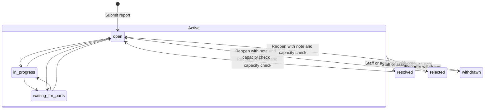

# Fix-ticket collections and lifecycle

Verified against the local Rails implementation on 2026-10-05. This describes
stored MongoDB documents, not the redacted API representation. See also
[repair-ticket operations](fix-tickets.MD), the [collection inventory](mongodb-collections.MD),
[jobs and services](jobs-tasks-services.MD), and the [API specification](../swagger/v1/swagger.json).

## Collections and references

| Collection | Model | Purpose |
| --- | --- | --- |
| `fix_tickets` | [FixTicket](../app/models/fix_ticket.rb) | Current report, status, assignments, visibility, linked bounty/reward, and Slack delivery-chain state. |
| `fix_ticket_events` | [FixTicketEvent](../app/models/fix_ticket_event.rb) | Ordered ticket history and transactional Slack notification outbox. Business events are retained; their delivery bookkeeping is mutable. |
| `fix_ticket_reveals` | [FixTicketReveal](../app/models/fix_ticket_reveal.rb) | Restricted record of each acknowledged admin reporter-identity reveal. |

New ticket `_id` values are positive sequence integers from
[Ticket.pull](../app/models/ticket.rb), backed by the `counter` collection document
`{ _id: "tickets", seq: <integer> }`. Allocation uses an atomic increment/upsert.
Numbers can have gaps; do not reset the production counter. The custom
[FixTicketId](../app/models/fix_ticket_id.rb) type accepts positive integers up to
signed 64-bit maximum, their string representations (optionally prefixed with
`#`), and legacy BSON ObjectIds. Event, bounty, and reward `ticket_id` references
use that same mixed-ID type. API IDs are strings. Event and reveal `_id` values
use Mongoid's normal BSON ObjectId default.

Related collections are `members` (reporter, actors, assignees, reveal admin;
also the transactional `fix_ticket_write_revision` lock), `shops`, `tools`,
`checkout_approvers` (staff scope and recipient selection), `volunteer_tasks`
(repair bounty), `volunteer_credits` (reporter reward and approved bounty work),
`audit_logs` (closure, reveal, and expiration audit), and `shortcodes` (bounty
announcement links). References are application-managed IDs, not embedded
documents or database-enforced foreign keys. Redis additionally holds the
renewable delivery lease; it is not a MongoDB collection.

## Lifecycle

Portal/API and Slack actions use [FixTicketService](../app/services/fix_ticket_service.rb).
Normal creation and mutations require MongoDB replica-set transactions. The
service increments the reporter's member write revision inside the transaction
to serialize capacity checks, priority insertion, ticket writes, and outbox
events. It reloads the acting member and checks permissions inside the mutation.
Queue submission and bounty canvas refresh happen after commit. An enqueue
failure does not roll back the saved event; delivery recovery can find it later.

1. **Create.** The reporter must be fully active and unexpired. Admin/board
   members bypass the open-ticket count limit, but not membership eligibility.
   Other reporters have a configurable active-ticket limit, default 10. Creation
   starts `open`/`unverified`, saves original priority and identity consent, and
   writes a `created` event. The same reporter/submission-key pair returns the
   existing ticket without another event or priority shift. Priority insertion
   shifts occupied slots upward until a gap; overflow beyond 10 becomes nil.
2. **Read and investigate.** Admin/board have global staff scope. Shop RMs and
   relevant checkout approvers have scoped staff access. Reporters and assignees
   can read and add notes; staff and assignees can change status/confirmation.
   Fully active, unexpired members can read public tickets, without write rights
   from public visibility alone. Staff can edit report/catalog fields and manage
   assignments. Assignment alone does not change ticket status. The service
   requires new assignees to be fully active and unexpired; it does not reapply
   that requirement to existing assignment permissions on each note/status edit.
3. **Notes and confirmation.** Notes require at least two non-whitespace
   characters and at most 10,000 characters. A reporter who is also an assignee
   must choose `respond_as: reporter` or `assignee`; this is saved as private
   `note_role`. Confirmation is independent of status. Changing to
   `could_not_confirm` requires a note. Notes/status edits append events.
4. **Close or withdraw.** Staff/assignees resolve or reject with a note. Only the
   reporter withdraws an active report via the dedicated withdrawal action;
   generic updates cannot set `withdrawn`. Terminal transitions clear priority,
   store `closed_by_id`, and create a `ticket_closed` audit record in the same
   transaction. Audit failure rolls back closure and its event. Reporter
   closures are anonymized in ordinary audit output. There is no ticket
   `closed_at` field; history/audit and business timestamps record the changes.
5. **Reopen.** A terminal ticket must return to `open` before any other status
   change. Reopening requires a note and a reporter capacity/membership check,
   clears `closed_by_id`, and leaves priority nil. Earlier events and audits
   remain. Withdrawal itself is not a delete operation; the ticket API exposes
   no destroy endpoint.

The [policy](../app/services/fix_ticket_policy.rb) and
[presenter](../app/services/fix_ticket_presenter.rb) are the permission/privacy
authorities. Hidden catalog references are redacted independently of ticket
access. `public_read_only` means readable by eligible authenticated members,
not anonymous public access. Changing category later never changes identity
consent. User-written titles, descriptions, and notes may disclose identity.

### Assignment, bounty, reward, and tool availability

Effective `assignee_ids` is the union of `manual_assignee_ids` and
`bounty_assignee_ids`. Staff edits change manual grants without converting
claim-derived access into manual access. A linked bounty claim adds its claimant;
release/rejection removes the claim-derived grant while retaining manual grants.
Self-unassignment removes both grants for that member. Assignment events omit
assignee-name deltas and use a neutral actor label in ordinary output.

Admin/board or the shop RM can create a bounty on an active ticket, unless they
are its reporter. Bounty creation writes an available `VolunteerTask` with
`ticket_id` and the ticket's shop, sets `bounty_id`, forces the ticket public, and
writes a `bounty` event. A replacement is allowed only with no linked bounty or
a cancelled linked bounty. While the bounty is available/claimed/pending, the
ticket cannot become private; a linked bounty also prevents a shop move that
would disagree with its shop. The reporter cannot claim their own bounty.
Claims require active, unexpired membership, an active ticket, and prerequisites.
Closing a ticket cancels an available unclaimed bounty. Claimed/pending bounties
must be released/rejected before explicit cancellation; subsequent cleanup
cancels the released task if the ticket is already terminal. Ticket resolution
and bounty credit verification are separate operations. See the
[bounty concern](../app/models/concerns/fix_ticket_bounty.rb).

An authorized non-reporter can nominate a one-credit reporter reward during
resolution, creating a pending `VolunteerCredit` and saving `reward_id`. A
different authorized reviewer, neither reporter nor nominator, approves/rejects
it only while the ticket is resolved. Review appends a `reward` event; approval
then runs the credit notification and discount checks after commit.

[Assignee expiration](../app/services/service/fix_ticket_assignee_expiration.rb)
removes existing member records failing `active_unexpired?` from all three
assignment arrays on active tickets. If no assignees remain, status returns to
`open`. This path saves the ticket and a general audit entry, **not** a
`FixTicketEvent`; it does not increment the ticket's event revision or enqueue
the usual ticket notifications. Missing member records are not selected by that
member query. Tool `out_of_service` is separate from ticket status and Hidden
(`disabled`): closing/reopening a ticket does not restore/change tool availability.

## `fix_tickets` schema and required fields

Types below are Mongoid declarations. Nil/absent legacy fields are possible;
defaults are application defaults, not proof of a stored BSON field on old
documents. Mongoid validations apply to model writes; they are not a MongoDB
server schema or foreign-key constraint.

| Field | Type / default | Required rule and meaning |
| --- | --- | --- |
| `_id` | `FixTicketId`; `Ticket.pull` | Document identity; new integer or legacy ObjectId. |
| `reporter_id` | ObjectId | Model presence required; service sets current reporter. Read-only in model. Private attribution. |
| `title` | String | Model presence required; maximum 150 characters; allowed ASCII letters, digits, spaces and `. , _ ( ) / -`. Format checked on creation/change. |
| `description` | String | Model presence required; maximum 10,000 characters. |
| `image_url` (proposed) | String; optional, no default | Full image/view URL associated with the initial report, such as a Google Drive file URL. Stores a reference only, not image bytes. Not yet declared or accepted by the current application. |
| `category` | String; no default | Model inclusion required: `damaged`, `broken`, `missing`, `donation_offer`, `other`. |
| `submission_key` | String | Model presence required; creation service requires 8–100 word characters or hyphens. Read-only; idempotency scope is reporter plus key. |
| `status` | String; `open` | Model inclusion required: `open`, `in_progress`, `waiting_for_parts`, `resolved`, `rejected`, `withdrawn`. |
| `confirmation` | String; `unverified` | Model inclusion required: `unverified`, `confirmed`, `could_not_confirm`. |
| `show_identity` | Boolean; `false` | Creation service defaults true for donation offers, false otherwise; explicit consent must be a boolean. Not accepted by normal updates. |
| `shop_id` | ObjectId | Optional; must reference an existing shop when supplied through service. |
| `tool_id` | ObjectId | Optional; supplied tool must exist in selected shop. Cannot coexist with a nonblank uncatalogued name. |
| `uncatalogued_tool` | String | Optional; same name character restrictions as title when nonblank and created/changed. No model length limit declared. |
| `priority` | Integer | Optional; model/service enforce integer 1–10. Creation only; may shift/clear automatically. |
| `submitted_priority` | Integer | Original creation priority, optional; model read-only. Not a second independently validated priority input. |
| `i_broke_it`, `i_can_fix_it` | Boolean; `false` each | Optional creation flags; service requires actual booleans if supplied. Not normal update fields. |
| `public_read_only` | Boolean; `false` | Visibility; service requires actual boolean if supplied; active bounty locks it true. |
| `assignee_ids` | Array; `[]` | Effective member ObjectIds; service-managed union of provenance arrays. |
| `manual_assignee_ids` | Array; `[]` | Manual assignment member ObjectIds. |
| `bounty_assignee_ids` | Array; `[]` | Bounty claim-derived member ObjectIds. |
| `announce_to_slack` | Boolean; `false` | Staff-controlled optional shop/tool announcement switch; boolean input enforced by service. |
| `announcement_note` | String; empty string | Staff-controlled announcement text; stripped by service; no model length limit declared. |
| `bounty_id` | ObjectId | Optional linked volunteer task. |
| `reward_id` | ObjectId | Optional linked reporter reward credit. |
| `closed_by_id` | ObjectId | Set on terminal transition, cleared on reopening; may be absent on legacy tickets. Private if closer is reporter. |
| `revision` | Integer; `0` | Increased by `event!`; optimistic concurrency input on updates is optional. A supplied mismatching revision rejects the update. |
| `created_at`, `updated_at` | Time; Mongoid timestamps | Business timestamps; `created_at` read-only. Event creation advances `updated_at`, including a note without report-field changes. |
| `slack_ticket_ts` | String | Optional central Slack root message timestamp. |
| `slack_ticket_channel_id` | String | Optional resolved channel for that root. |
| `slack_ticket_team_id` | String | Optional workspace identity for root reuse. |
| `delivery_job_id` | String | Optional persisted Active Job chain owner. |
| `delivery_job_until` | Time | Optional chain reservation deadline. |

Only the documented creation allowlist is accepted by `create!`; callers cannot
set reporter, status, assignments, links, revisions, or delivery state there.
Strings are stripped by the service. Reference IDs must be valid ObjectIds.
Catalog visibility also restricts ordinary creation; admin/board and the shop RM
can reference hidden resources. Staff edits enforce scope again after a shop/tool
move. Operational Slack root and job-marker writes do not advance `updated_at`.

### Indexes

MongoDB provides the unique `_id` index. Explicit model indexes are:

| Keys (in declared order) | Options / purpose |
| --- | --- |
| `{ reporter_id: 1, submission_key: 1 }` | Unique; reporter-scoped submission idempotency. |
| `{ reporter_id: 1, status: 1, priority: 1 }` | Reporter active-ticket counts/priority lookup. |
| `{ assignee_ids: 1, status: 1 }` | Multikey assignment/status lookup. |
| `{ public_read_only: 1, status: 1 }` | Public-member ticket/status lookup. |
| `{ shop_id: 1, tool_id: 1, status: 1 }` | Catalog scope/status lookup. |
| `{ priority: 1, created_at: 1 }` | Priority/creation ordering. |
| `{ updated_at: -1 }` | Recent business activity ordering. |

## `fix_ticket_events` schema and delivery lifecycle

This model declares **no explicit validations or read-only attributes**. Normal
service-created events supply `ticket_id`, `actor_id`, `kind`, and `revision`;
these are workflow requirements, not model presence validations. Default hashes,
arrays, booleans, and timestamps fill the other fields. There is no `updated_at`.

| Field | Type / default | Meaning |
| --- | --- | --- |
| `_id` | ObjectId; generated | Event identity and basis for stable Slack message IDs. |
| `ticket_id` | `FixTicketId` | Parent integer/legacy ObjectId ticket ID. |
| `actor_id` | ObjectId | Acting member; private, projected through privacy-aware actor labels. |
| `kind` | String | Service writes `created`, `updated`, `note`, `assigned`, `bounty`, `reward`; no model enum validation. |
| `note` | String | Optional validated service note; full discussion text. |
| `image_url` (proposed) | String; optional, no default | Full image/view URL associated with this individual event or discussion message, such as a Google Drive file URL. Stores a reference only, not image bytes. Not yet declared or accepted by the current application. |
| `note_role` | String | Optional captured author context: `reporter`, `assignee`, or nil for staff/legacy notes. Private. |
| `field_changes` | Hash; `{}` | Typically field name to `[before, after]`; assignment events omit `assignees` deltas. Presenter additionally redacts legacy deltas/catalog references. |
| `recipients` | Array; `[]` | Deduplicated member ObjectIds selected at event creation; delivery rechecks current access/suppression. |
| `unscoped_staff_notification` | Boolean; `false` | Creation or note-bearing event without a shop; posts to RM Channel independently of central channel configuration. |
| `created_at` | Time; `Time.current` | Event creation timestamp. |
| `revision` | Integer | Ticket revision after `event!` increments it. Unique within ticket. |
| `central_enabled` | Boolean; current `SystemConfig.slack_tickets_channel.present?` | Captures central-channel enablement when event is created; disabled-time events are not later backfilled centrally. |
| `delivered` | Hash; `{}` | Logical destination/chunk key to `{ 'ts': String, 'channel': String }` Slack receipt. |
| `delivery_attempts` | Hash; `{}` | Logical key to `{ 'channel': String, 'thread_ts': String or nil, 'oldest': String }` persisted pre-send intent. |
| `delivery_error` | String | Last delivery exception class name; cleared on successful event completion. |
| `completed_at` | Time | Nil/absent until all applicable delivery operations finish, including skipped recipients/destinations. Does not mean repair resolved. |

Explicit indexes: unique `{ ticket_id: 1, revision: 1 }` and nonunique
`{ completed_at: 1, created_at: 1 }`, in addition to unique `_id`. Neither is
sparse/partial or TTL. The compound uniqueness is not a substitute for required
field validation: direct malformed writes can occupy null-valued unique keys.

[FixTicketDeliveryJob](../app/jobs/fix_ticket_delivery_job.rb) processes incomplete
events in revision order, using a persisted 24-hour retry-chain reservation and
a renewable 120-second Redis lease. It retries standard errors up to eight
attempts with polynomial delays. The
[recovery job](../app/jobs/fix_ticket_delivery_recovery_job.rb) scans incomplete
events every ten minutes and enqueues tickets without a live chain reservation.

[FixTicketDelivery](../app/services/fix_ticket_delivery.rb) stores an intent before
posting and a receipt afterward. Stable `client_msg_id` values derive from event
ID plus logical destination key; uncertain sends are reconciled against Slack
history/replies before retry. Receipt keys include `unscoped-staff-<chunk>`,
`shop-<chunk>`, `dm-<member ID>-<chunk>`, root keys, and thread-specific central
keys. Text is split into 2,900-character chunks. Saved receipts skip delivered
chunks. Central receipts are scoped to workspace/channel/thread, so a replaced
root gets new deliveries; compatible legacy central keys are reused.

Delivery uses current ticket state and configuration, not a complete historical
ticket snapshot. The central root lives on the ticket; events hold replies and
other receipts. Bounties broadcast the first central reply chunk. Optional shop
announcements use tool announce channel, tool users channel, then shop channel,
and do not duplicate the central destination. Missing optional shop destinations
are skipped. DMs require an existing member, current ticket access, an unsuppressed
direct-notification state, and a linked Slack user. Full notes in a configured
central channel can be seen by its participants regardless of portal access.
Human Slack replies are not imported. See the operational guide for configuration.

### Proposed image URL references

The proposed `image_url` field belongs on both `fix_tickets` and
`fix_ticket_events` (the existing collection name is singular `ticket`). A ticket
URL represents the initial report's photo; an event URL represents the photo
attached to that particular follow-up message. Each field holds one URL, for
example `https://drive.google.com/file/d/<file-id>/view`. It is optional, so
reports and discussion messages can continue without a photo. A Drive view URL
opens a file viewer; it is not necessarily a direct image URL suitable for an
inline image element.

This is a documented schema proposal, not implemented behavior. The current
models do not declare `image_url`, and the service input allowlists and API
presenters do not support it. No required-field validation, URL validation,
index, upload handling, or Slack rendering has been implemented for these
fields. Implementing them requires corresponding model, service, presentation,
and API contract changes.

Only the URL would be stored in MongoDB; image content remains in Google Drive
or another external host. Saving a URL does not grant access to the image.
Drive sharing must allow the intended viewers, and a member-readable shared
folder can expose a photo more widely than its private ticket. Keep reporter
identity out of filenames and URL labels, consistently with ticket privacy.

## `fix_ticket_reveals` schema and privacy lifecycle

The model declares **no explicit validations**, enums, read-only fields, or
`updated_at`. Normal controller writes supply ticket/admin IDs; raw model writes
do not validate those references or enforce admin role.

| Field | Type / default | Required workflow meaning |
| --- | --- | --- |
| `_id` | ObjectId; generated | Reveal record identity. |
| `ticket_id` | `FixTicketId` | Required by controller workflow: ticket being revealed. |
| `admin_id` | ObjectId | Required by controller workflow: authenticated acting admin. |
| `created_at` | Time; `Time.current` | Reveal attempt timestamp. |

Explicit index: nonunique `{ ticket_id: 1, created_at: -1 }`, plus unique `_id`.
There is no per-admin/ticket uniqueness or TTL; repeated acknowledged reveals
create additional records. Reporter identity is not copied into this collection.

The [reveal endpoint](../app/controllers/fix_tickets_controller.rb) requires ticket
read access, role exactly `admin` (board alone is insufficient), and
`acknowledged: true`. It creates the restricted reveal record, then a general
`ticket_reporter_revealed` audit containing the ticket ID/title and acting admin,
without reporter identity. If general auditing fails, the response is withheld
with service-unavailable; the earlier reveal record can remain because this
sequence is not wrapped in the ticket transaction. Success returns reporter
name/ID, or `Former member`/nil if deleted. Responses are `no-store`.

Ordinary history and API output use the presenter rather than raw documents.
Reporter attribution is hidden unless creation consent permits it; reveal records
are deliberately separate from board-readable general audits. Restrict database
and backup access accordingly. No automatic retention/purge or cascade cleanup
is declared on these three models, and no ticket delete API is provided.

## Deployment and verification references

Index declarations do not install indexes on an existing database. The release
entry point [data:ensure_unique_indexes](../lib/tasks/unique_indexes.rake) calls
`create_indexes` for all three models. Run `bundle exec rake data:ensure_unique_indexes`
before enabling submissions; `fix_tickets:ensure_indexes` is a compatibility
alias. Existing duplicates cause unique index creation to fail; resolve them
without discarding attribution/history. None of these indexes expires records.

Relevant executable coverage includes
[service lifecycle/transactions](../spec/services/fix_ticket_service_spec.rb),
[policy](../spec/services/fix_ticket_policy_spec.rb),
[privacy projections](../spec/services/fix_ticket_presentation_privacy_spec.rb),
[Slack delivery](../spec/services/fix_ticket_delivery_spec.rb),
[lease handling](../spec/services/fix_ticket_delivery_lease_spec.rb),
[assignment expiration](../spec/services/fix_ticket_assignee_expiration_spec.rb),
[mixed ticket IDs](../spec/models/fix_ticket_id_spec.rb), and
[API contracts](../spec/api/fix_tickets_spec.rb). Direct database writes can bypass
service transactions, permission checks, revision/event creation, and model
validations; they do not reproduce the documented lifecycle automatically.
